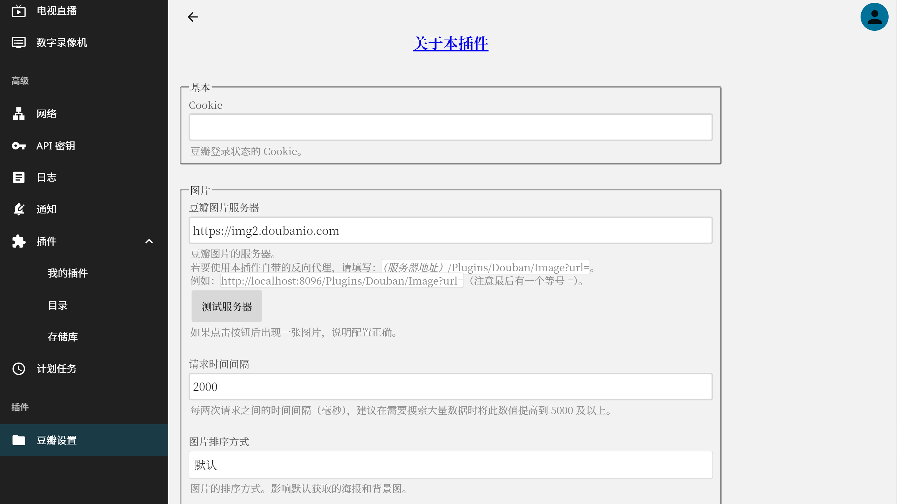

# Jellyfin 豆瓣元数据插件

参考 [jellyfin-plugin-bangumi](https://github.com/kookxiang/jellyfin-plugin-bangumi) 和 [jellyfin-plugin-opendouban](https://github.com/caryyu/jellyfin-plugin-opendouban) 制作的豆瓣元数据插件，支持电影、电视剧元数据获取。

相较于 [jellyfin-plugin-opendouban](https://github.com/caryyu/jellyfin-plugin-opendouban) 插件，本插件无需额外运行 Docker 容器。

**[详细说明及更新日志](https://xzonn.top/posts/Jellyfin-Plugin-Douban.html)**

## 安装
**注意**：Jellyfin 10.9.x 版本和 10.10.x 版本的插件互相不兼容。对于 Jellyfin 10.9.11 版本，请使用本插件的 2.x 版本；对于 Jellyfin 10.10.0 及以上版本，请使用本插件的 3.x 版本。

### 插件库
- 打开控制台，选择`插件`→`存储库`→`添加`
- 在`存储库 URL`处填入：`https://xzonn.top/JellyfinPluginDouban/manifest.json`
- 在插件目录中找到 Douban 插件，选择安装
- 重启 Jellyfin

### 手动安装
- 下载插件压缩包，将 dll 文件解压至 `<Jellyfin 数据目录>/Plugins/Douban`
- 重启 Jellyfin

